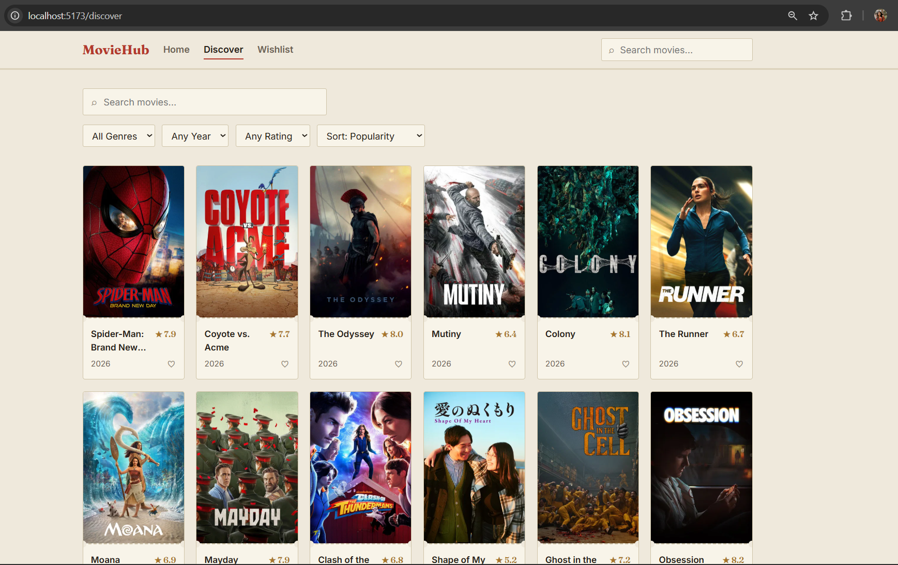
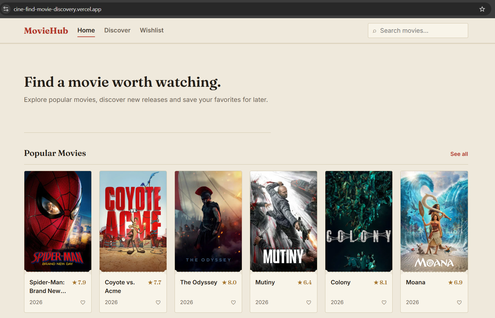
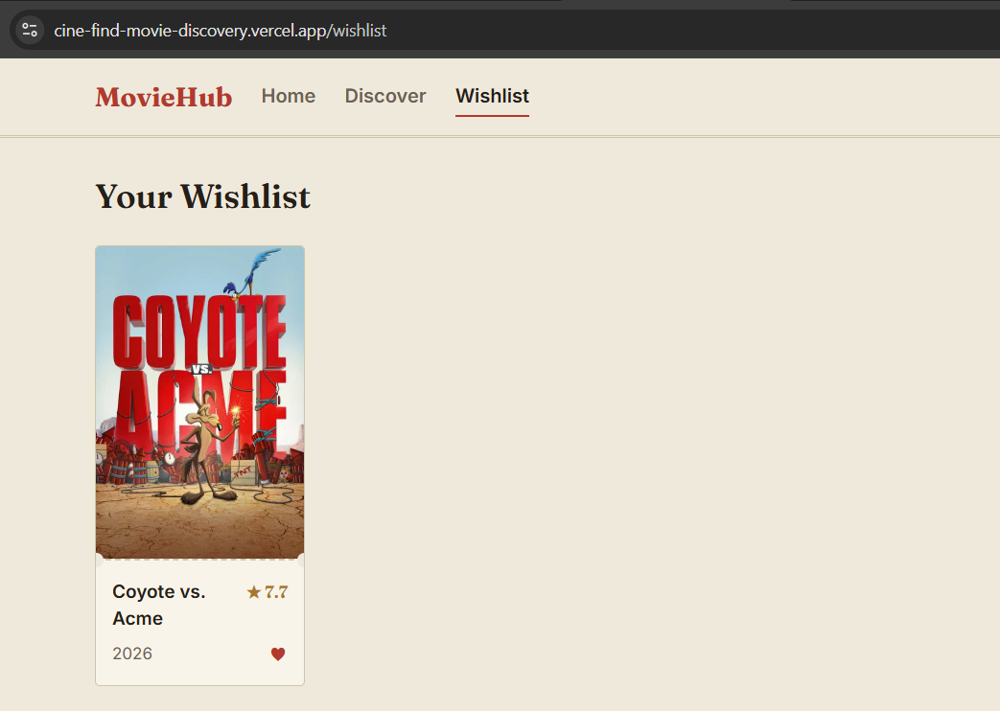

# 🎬 CineFind — Movie Discovery Platform

A full-stack movie discovery application that allows users to browse, search, filter, sort, view movie details, and save movies to a persistent wishlist.

CineFind uses the TMDB API for movie data, a React frontend, an Express backend, and MySQL for wishlist storage.

---

## 🚀 Live Demo

🌐 **Frontend:**  
https://cine-find-movie-discovery.vercel.app

🔗 **Backend API:**  
https://cinefind-movie-discovery.onrender.com

💻 **GitHub:**  
https://github.com/Muskan-Gupta-tech/CineFind-Movie-Discovery

---

## 🎥 Demo Video

▶️ **[Watch CineFind Demo Video](https://drive.google.com/file/d/1_X2ZKEirZqJDOGNKNEi3PIrvlRP-_9_Z/view?usp=sharing)**

---

## 📸 Demo Images

### 🏠 Home Page



### 🔎 Discover Movies



### ❤️ Wishlist



---

## 🎯 Problem Statement

The goal was to build a realistic movie discovery product using a third-party movie API.

The application should allow users to:

- Browse movies
- Search for movies
- Filter and sort results
- View detailed movie information
- Save movies to a wishlist
- Handle loading, errors, slow responses, and API failures

The frontend communicates only with the application's own backend rather than directly with TMDB.

---

## ✨ Features

- 🎬 Popular, Top Rated, Now Playing and Upcoming movies
- 🔎 Debounced movie search
- 🎭 Filter by genre and year
- ⭐ Filter by minimum rating
- ↕️ Sort by popularity, rating, release date and title
- 📄 Movie details with genres, runtime and cast/director
- ❤️ Persistent wishlist using MySQL
- 🚫 Duplicate wishlist prevention
- ⚡ Backend response caching
- 🛑 Request cancellation for stale searches
- 📱 Responsive desktop, tablet and mobile UI
- 🚨 Consistent API success/error responses

---

## 🏗️ Architecture

```text
                ┌───────────────┐
                │     User      │
                └───────┬───────┘
                        │
                        ▼
              ┌─────────────────┐
              │ React + Vite    │
              │    Frontend     │
              │     Vercel      │
              └────────┬────────┘
                       │ REST / JSON
                       ▼
              ┌─────────────────┐
              │ Node.js +       │
              │ Express Backend │
              │     Render      │
              └───────┬─────┬───┘
                      │     │
             ┌────────┘     └────────┐
             ▼                       ▼
       ┌───────────┐           ┌────────────┐
       │ TMDB API  │           │ MySQL DB   │
       │ Movie Data│           │  Wishlist  │
       └───────────┘           └────────────┘
the images are not opened how i do for show in repository
